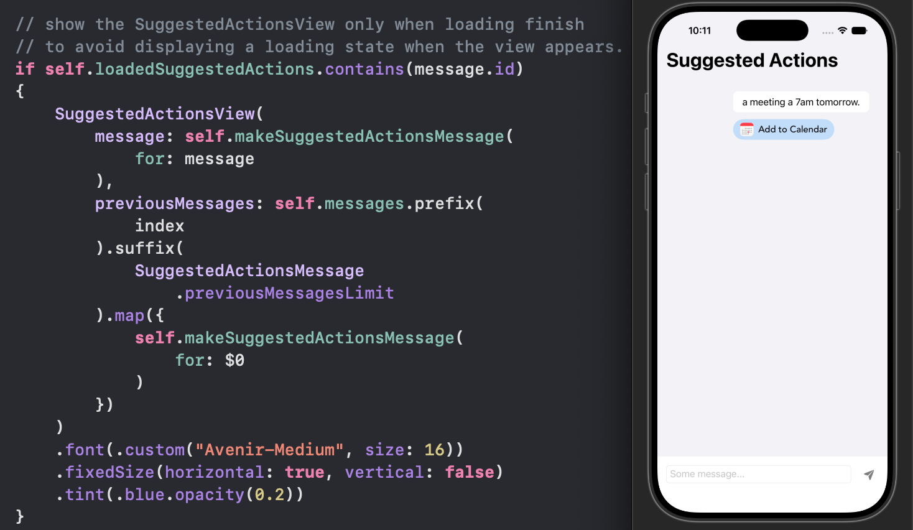

# SwiftUI_SuggestedActionDemo

A demo of providing quick actions to messages in a message app with the SuggestedAction framework.

To run the demo, make sure to first add the [Suggested Actions](https://developer.apple.com/documentation/BundleResources/Entitlements/com.apple.developer.suggested-actions) entitlement to the app target.

For more details, please refer to my blog [SwiftUI: (A Little) Better Message App With Context Based Quick Actions]()

